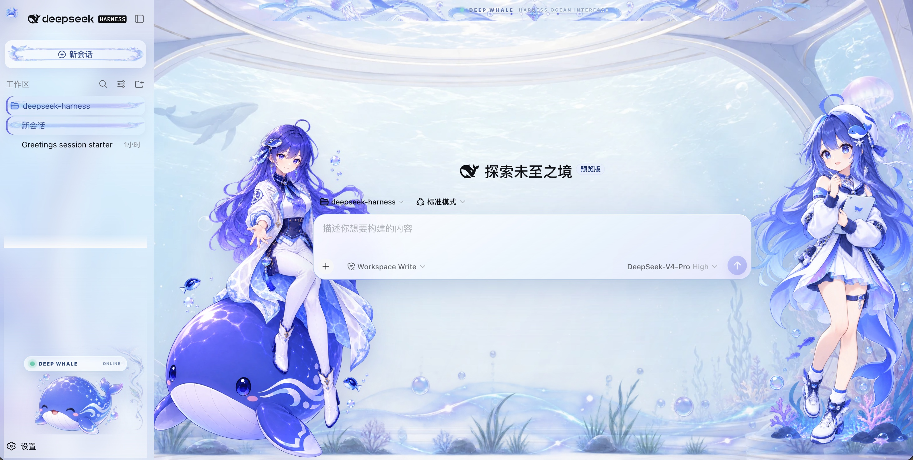
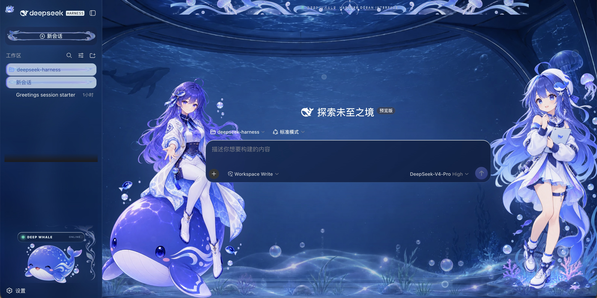

# Deep Whale · DeepSeek Harness Theme

[](https://github.com/NiShuoBuShuo/deepseek-harness-theme/actions/workflows/check.yml)
[](LICENSE)

面向 [DeepSeek Harness](https://github.com/deepseek-ai/deepseek-harness) Web UI 的非官方二次元深海鲸鱼主题。

Deep Whale 保留 Harness 原生的侧栏、会话区、详情栏、设置和 Agent 工作流，只通过可撤销的客户端皮肤加入浅蓝/靛蓝海洋背景、双侧人物、鲸鱼、水母、半透明玻璃卡片和状态装饰。它不是 Dashboard 重制，也不会伪造 Harness 中不存在的功能。

> DeepSeek Harness 当前仍处于 Developer Preview，官方可能进行不兼容的界面调整。本主题会尽量跟进，但升级 DSH 后仍建议重新执行一次验证。

## 效果预览

| 浅色模式 | 深色模式 |
| --- | --- |
|  |  |

## 主要特性

- 保留 Harness 原生三栏信息架构和所有交互组件。
- 支持浅色、深色及跟随系统主题。
- Hero、Settling、Active 三个会话阶段使用不同的角色尺寸和海床构图。
- 会话开始后仍保留左右人物，并避让消息、详情栏和输入框。
- 左侧栏采用 0.5 半透明磨砂，左下角保留鲸鱼、状态条和设置入口。
- Details、Composer、Todo、菜单及设置弹窗具有独立的浅色/深色玻璃样式。
- 15 张源素材均保存在仓库；运行中使用的 13 张素材内嵌进 `lib/client.js`，无需远程图片服务。
- 所有装饰层均为 `pointer-events: none`，不会拦截点击或键盘操作。
- `ctx.effect()` 销毁器会移除主题节点、CSS 变量和观察器，卸载后恢复原界面。

## 安装

需要 Git、Node.js，以及可以正常运行的 DeepSeek Harness。

```sh
git clone https://github.com/NiShuoBuShuo/deepseek-harness-theme.git
cd deepseek-harness-theme
npx -y @deepseek-ai/dsh plugin --profile web add "$PWD"
npx -y @deepseek-ai/dsh web
```

默认 Web 地址为 <http://127.0.0.1:3080>。如果 `dsh web` 已经运行，请重启服务并在浏览器中强制刷新：

- macOS：`Cmd + Shift + R`
- Windows / Linux：`Ctrl + Shift + R`

Windows PowerShell 可将 `$PWD` 替换为仓库的绝对路径。

### 从早期本地版本迁移

早期开发版本使用 `@local` 包名。若安装过该版本，先移除旧包，再安装当前仓库：

```sh
npx -y @deepseek-ai/dsh plugin --profile web remove @local/dsh-client-ui-skin-deep-whale
npx -y @deepseek-ai/dsh plugin --profile web add "/absolute/path/to/deepseek-harness-theme"
```

### 更新

```sh
cd deepseek-harness-theme
git pull --ff-only
npx -y @deepseek-ai/dsh plugin --profile web remove @nishuobushuo/dsh-client-ui-skin-deep-whale
npx -y @deepseek-ai/dsh plugin --profile web add "$PWD"
```

随后重启 `dsh web`。

### 卸载

```sh
npx -y @deepseek-ai/dsh plugin --profile web remove @nishuobushuo/dsh-client-ui-skin-deep-whale
```

## 验证主题是否加载

主题生效后应满足：

- 页面出现 Deep Whale 背景、顶部水纹和左右人物。
- 左下角显示 `DEEP WHALE · ONLINE`。
- 打开会话后人物缩小并移动到安全边缘，但不会消失。
- 设置弹窗位于窗口中央；关闭后侧栏恢复半透明磨砂。
- 页面 `<body>` 上存在 `data-dsh-deep-whale` 属性。

## 开发与构建

仓库提交了可直接安装的 `lib/` 构建产物。重新构建只需要 Node.js 和 pnpm：

```sh
corepack enable
pnpm check
npm pack --dry-run
```

`pnpm check` 会重新生成 `lib/client.js`，然后执行插件结构测试。构建会把正在使用的 WebP 素材转换为 data URI，因此运行时不依赖 `assets/` 路径或外部 URL。

## 项目结构

```text
.
├── assets/deep-whale/       # 1–15 号 WebP 源素材与映射表
├── preview/                 # 真实 Harness 浅色/深色预览
├── src/client/              # DOM 标记、生命周期和主题 CSS
├── scripts/build.mjs        # 素材嵌入与 client bundle 生成
├── lib/                     # DSH 可直接加载的构建产物
├── tests/                   # ModuleLoader、清理器和包结构检查
├── cordis.patch.yml         # DSH bundle 注册
├── skin.json                # 主题元数据
└── NOTICE                   # 素材与参考项目说明
```

每张图片的尺寸、用途和当前启用状态见 [assets/deep-whale/README.md](assets/deep-whale/README.md)。

## 实现边界

- 不修改 DeepSeek Harness 源码，不注入服务端逻辑，也不接触模型请求。
- 不把 Harness 重做成 Dashboard、Landing Page 或其他产品。
- 优先使用稳定的 `data-*` 和 ARIA 钩子；对 CSS Modules 类名仅做局部包含匹配。
- 功能文字与控件位于人物和装饰层之上；人物层不接收输入事件。
- 侧栏收缩、详情栏开关、设置弹窗及窄视口均有独立处理。

## 参考项目与致谢

- [deepseek-ai/deepseek-harness](https://github.com/deepseek-ai/deepseek-harness)：主题运行的官方 Agent Harness；其插件化架构由 Cordis 驱动。
- [Small-tailqwq/dsh-deep-whale](https://github.com/Small-tailqwq/dsh-deep-whale)：客户端皮肤的分发方式、Cordis 生命周期、静态素材内嵌和资源组织的重要参考。
- [dsh-external/dsh-web-ui](https://github.com/dsh-external/dsh-web-ui)：`dsh-deep-whale` README 中注明的皮肤工程脚手架来源。

本仓库没有复制 `dsh-deep-whale` 的 CSS 或图片；具体说明见 [NOTICE](NOTICE)。DeepSeek、DeepSeek Harness 及相关标识归其权利人所有，本项目不代表官方背书。

## 许可

本主题以 [CC BY-NC-SA 4.0](LICENSE) 发布：必须署名、仅限非商业用途，衍生作品须以相同许可共享。
